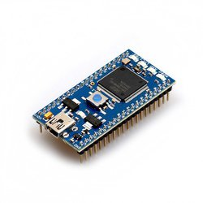
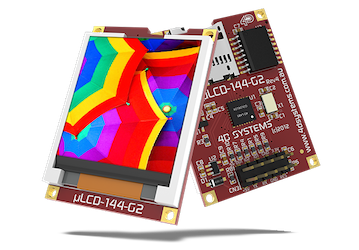
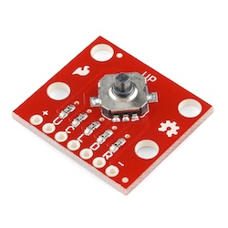
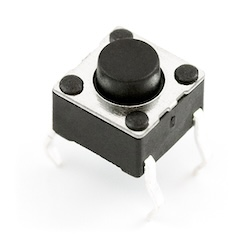

# RPGGAME_4180FinalProject
ECE-4180 Final Project

Project Team Members:
  Jordan Elliot, Milca Takou, Yimaj Ahmed

Project Goal: The goal of this project was to develop a role-playing game (RPG) that runs on an mbed microcontroller and is displayed on a LCD screen. This project involves a player-controlled character displayed on an LCD screen, using input devices such as buttons and a navigation switch. The game will be developed in C/C++ on the mbed microcontroller platform, which will handle the game's logic and graphical output. The game will feature a player-controlled character that can navigate through a virtual environment and interact with various elements in the game. The successful completion of this project will result in a fully functional RPG game that can be played on an mbed microcontroller with an LCD screen.

Plot of the Game:
     Embark on an epic quest in our RPG game! Begin by guiding your character to the right, where you'll encounter a Non-Playable Character (NPC). Interact with the NPC by pressing the action button when adjacent. The NPC will provide valuable hints on how to defeat the formidable Wizard Buzz and guide you to your next destination.
Venture leftward to discover a cave entrance represented by a distinct gray square. Position your character within the region and press the action button to teleport into Wizard Buzz’s sinister lair. To vanquish Wizard Buzz, stand on the correct spell tile and activate it using the action button. Listen closely to the NPC's advice; the correct spell, indicated by a blue water drop sprite, is crucial for victory.
After defeating Wizard Buzz, witness its transformation into a humble bee. Navigate your character to the staircase on the far left to exit the room and return to the NPC. Receive a key as a token of appreciation from the NPC. To complete the game, journey to the far right until you encounter a golden gate door. Approach the door, utilize the action key to unlock the chest, and revel in the triumphant "You Win!" screen.

Schematic:
Explore the intricate wiring and connections of our project in the schematic diagram provided below.

   
Demo Curious to see our RPG game in action? Watch our demo video showcasing the gameplay dynamics and features.

https://youtu.be/FSfTeyy1Dsc

Wiring:

      

                                  
Parts Used:​

Discover the core components utilized in our project:
- **mbed LPC1768**: The foundation of our microcontroller system.

- **uLCD-144-G2**: The LCD screen, offering vibrant visuals and user interaction.

- **Speaker - PCB Mount**: Enhancing gameplay with immersive audio feedback.

- **Navigation Switch**: Providing intuitive control for character movement.
   

- **Pushbuttons**: Essential for interacting with in-game elements and NPCs.

