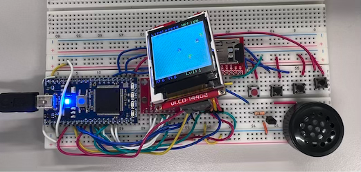

# RPGGAME_4180FinalProject
ECE-4180 Final Project

Project Team Members:
  Jordan Elliot, Milca Takou, Yimaj Ahmed

Project Goal: The goal of this project was to develop a role-playing game (RPG) that runs on an mbed microcontroller and is displayed on a LCD screen. This project involves a player-controlled character displayed on an LCD screen, using input devices such as buttons and a navigation switch. The game will be developed in C/C++ on the mbed microcontroller platform, which will handle the game's logic and graphical output. The game will feature a player-controlled character that can navigate through a virtual environment and interact with various elements in the game. The successful completion of this project will result in a fully functional RPG game that can be played on an mbed microcontroller with an LCD screen.

Plot of the Game:
      __________________

Schematic:
      __________
    
Demo:
        https://youtu.be/FSfTeyy1Dsc

Wiring:

Parts Used:​

mbed LPC1768​

uLCD-144-G2​

  
Speaker - PCB Mount​

Navigation Switch​

 

Pushbuttons

  
